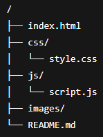

# EventFinder

EventFinder is a sleek, responsive web application designed to help users discover and register for exciting events happening near them. Featuring a clean interface, dynamic event listings, and smooth carousel navigation, EventFinder provides an intuitive experience for exploring local and global events.

## Table of Contents

- [Introduction](#introduction)
- [Features](#features)
- [Demo](#demo)
- [Technologies Used](#technologies-used)
- [Usage](#usage)
- [Project Structure](#project-structure)
- [Customization](#customization)
- [Contributing](#contributing)
- [License](#license)

## Introduction

EventFinder offers a user-friendly platform for browsing upcoming events with an emphasis on responsive design and accessibility. Whether you want to find local meetups, concerts, or global webinars, EventFinder makes it simple and enjoyable.

## Features

- Responsive design with Bootstrap 5
- Dynamic event cards populated from a JavaScript data array
- Search functionality to filter events by name
- Smooth horizontal carousel with navigation arrows and auto-scroll
- Intersection Observer animations for event card fade-in effects
- Semantic HTML5 and accessible markup
- Clean and modern UI with Google Fonts and Bootstrap Icons

## Demo

## Technologies Used

- HTML5
- CSS3 (with custom styles)
- JavaScript (ES6+)
- Bootstrap 5 for layout and components
- Bootstrap Icons
- Google Fonts (Inter)

## Usage

- Clone the repository or download the ZIP.
- Open `index.html` in your browser (no build tools or servers required).
- Use the search bar to filter events by their names.
- Click the left and right arrows to scroll through featured events manually.
- The carousel also auto-scrolls every 4 seconds.
- Click **Register** on any event card to proceed (you can extend this with a registration backend).

## Project Structure

Here’s a brief overview of the main files and folders:

- `index.html` — main HTML page
- `css/` — custom stylesheets
- `js/` — JavaScript files for dynamic behavior
- `images/` — images used in the project

## Customization

You can customize the project by:

- Editing the `events` data array in the JavaScript file to add or remove events.
- Changing the styles in the CSS files to match your branding.
- Extending the registration button functionality to connect with your backend system.

## Contributing

Contributions are welcome! Feel free to submit issues or pull requests to improve EventFinder. Please follow standard best practices for commits and code style.

## License

This project is licensed under the MIT License. See the [LICENSE](LICENSE) file for details.

Thanks for checking out EventFinder! Enjoy exploring and discovering events near you.
